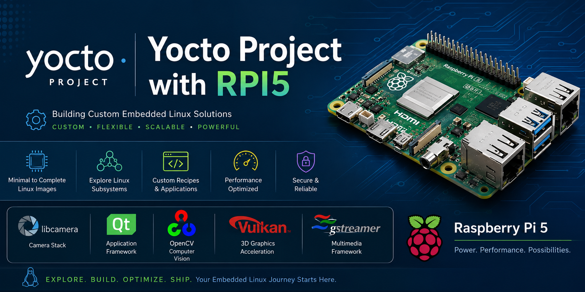

<p align="center">
  
</p>

# meta-rpi5-custom

A custom Yocto/OpenEmbedded layer for Raspberry Pi 5 focused on learning, experimenting, and mastering the Embedded Linux software stack from the ground up.

---

## Overview

The primary goal of this repository is to provide a hands-on learning environment for exploring various Embedded Linux subsystems while building custom Linux distributions using the Yocto Project.

This layer starts from a minimal Yocto image and incrementally adds features and packages to understand how different software components interact within a complete embedded Linux system.

The repository serves as a practical playground for developers who want to gain a deeper understanding of:

* Yocto Project
* OpenEmbedded Build System
* Linux Kernel Integration
* Device Tree Customization
* Boot Process
* Root Filesystem Generation
* Package Management
* Embedded Application Deployment

---

## Learning Objectives

This project aims to explore and understand the following Embedded Linux stacks:

### Boot Stack

* Raspberry Pi Boot Flow
* EEPROM Firmware
* U-Boot Integration
* Linux Kernel Boot Process
* Init Systems (SysVinit / Systemd)

### Linux Kernel Stack

* Kernel Configuration
* Device Tree Development
* Kernel Modules
* Driver Integration
* GPIO, I2C, SPI, UART

### Networking Stack

* Ethernet Configuration
* DHCP and Static Networking
* TCP/IP Fundamentals
* Socket Programming
* Network Utilities
* SSH and Remote Access

### Graphics Stack

* DRM/KMS
* Framebuffer
* Wayland
* Weston
* OpenGL ES
* Qt Graphics Stack

### Multimedia Stack

* V4L2
* GStreamer
* Camera Integration
* Audio Subsystem (ALSA)
* Video Playback Pipelines

### Application Frameworks

* Qt6
* Python
* Embedded GUI Development
* AI/ML Framework Integration

### System Services

* BusyBox
* Systemd
* Logging
* Watchdog
* OTA Concepts

---

## Repository Structure

```text
.
├── LICENSE
├── meta-rpi5-custom
│   ├── conf
│   │   └── layer.conf
│   ├── COPYING.MIT
│   ├── README
│   ├── recipes-core
│   │   └── images
│   │       └── custom-rpi-image.bb
│   └── recipes-example
│       └── example
│           └── example_0.1.bb
```

### Description

| Directory           | Purpose                                     |
| ------------------- | ------------------------------------------- |
| conf                | Layer configuration files                   |
| recipes-core/images | Custom image recipes                        |
| recipes-example     | Example recipes for learning Yocto concepts |
| COPYING.MIT         | Layer licensing information                 |

---

## Supported Hardware

### Raspberry Pi 5

* Raspberry Pi 5 Model B
* 4GB / 8GB Variants
* 64-bit Architecture (ARM Cortex-A76)

---

## Build Environment

### Host Operating System

Recommended:

* Ubuntu 22.04 LTS
* Ubuntu 24.04 LTS

### Yocto Releases

This repository is intended to be compatible with modern Yocto releases such as:

* Scarthgap
* Styhead

---

## Layer Integration

Add the layer to your build environment:

```bash
bitbake-layers add-layer ../meta-rpi5-custom
```

Verify:

```bash
bitbake-layers show-layers
```

---

## Building the Custom Image

Build the example image:

```bash
bitbake custom-rpi-image
```

Generated artifacts can be found in:

```text
tmp/deploy/images/raspberrypi5/
```

Typical outputs:

```text
custom-rpi-image-raspberrypi5.rootfs.wic.bz2
custom-rpi-image-raspberrypi5.rootfs.wic.bmap
```

---

## Flashing the Image

Using bmaptool:

```bash
sudo bmaptool copy \
custom-rpi-image-raspberrypi5.rootfs.wic.bz2 \
/dev/sdX
```

Using dd:

```bash
bzcat custom-rpi-image-raspberrypi5.rootfs.wic.bz2 | \
sudo dd of=/dev/sdX bs=4M status=progress conv=fsync
```

---

## Future Roadmap

Planned additions include:

* Custom Device Tree Development
* U-Boot Customization
* Qt6 Integration
* Wayland/Weston Graphics
* GStreamer Multimedia Pipelines
* Camera Support
* AI/ML Framework Deployment
* Docker Integration
* OTA Update Mechanisms
* Industrial Communication Protocols

  * Modbus RTU
  * Modbus TCP
  * CAN Bus
  * RS-485
* Security and Secure Boot Concepts

---

## Target Audience

This repository is intended for:

* Embedded Linux Developers
* Yocto Beginners
* BSP Engineers
* Linux Device Driver Developers
* IoT Developers
* Students Learning Embedded Systems

---

## License

This project is licensed under the MIT License.

See the LICENSE and COPYING.MIT files for details.

---

## Author

Mahendra Sondagar

Embedded Linux | Yocto | BSP | Device Drivers | Industrial IoT

---

## Contributions

Contributions, suggestions, and improvements are welcome.

Feel free to open issues or submit pull requests to improve the learning content and examples.

